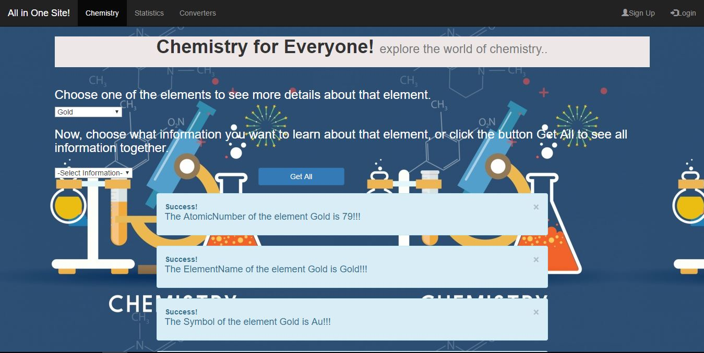
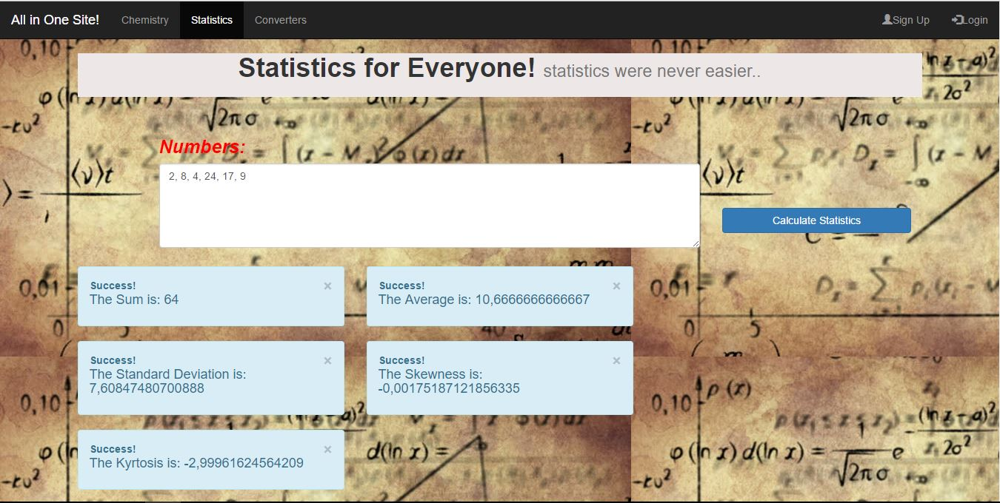
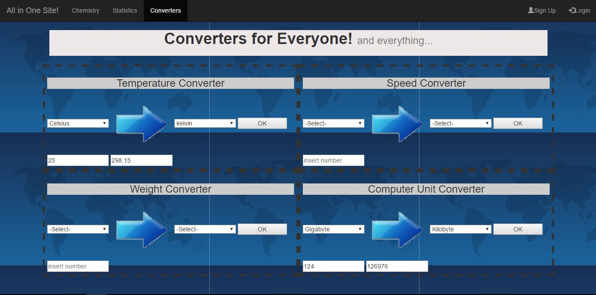

### Web Services. 
##### This is a website that uses some web services.

note: the project has been developed in Visual Studio 2015. 

How to use it:

To test the webpage, import the entire solution in Visual Studio, Build it, and the run the project in any browser.

There are 6 different web services in this website. 4 of them are for unit conversions, one is for statistics calculations and the other one is for chemistry elements information.

You can navigate to the project to explore it more. There are some screenshots below if anyone is interested.

## The chemistry page:

## The statistics page:

## The converters page:

